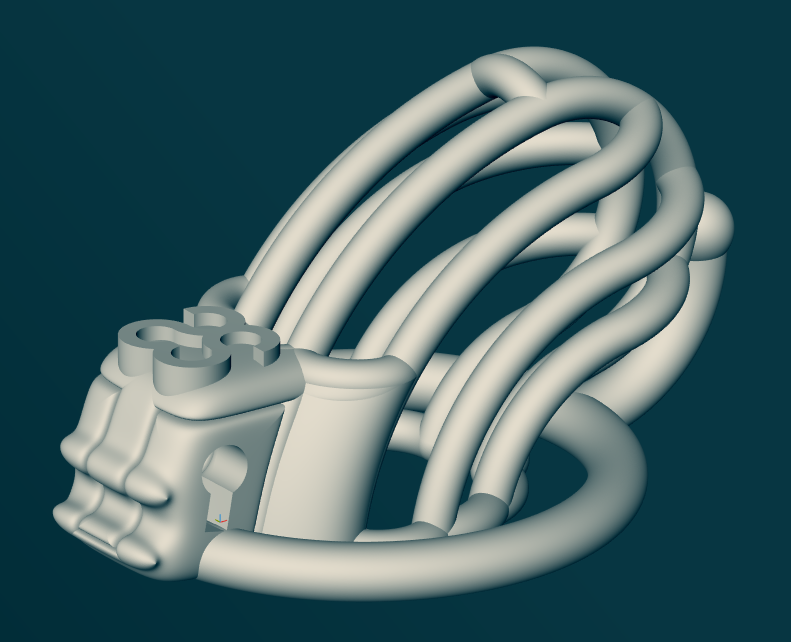

# Long-Term Discreet Chastity Cage (LTDCC)
## A parametric chastity cage model generator by [journeymanoc](https://github.com/journeymanoc)

Design inspired by [heyspacebuck's parametric model](https://github.com/heyspacebuck/parametric-chastity-cage).

## Description

This is a customizable model of a chastity cage.
It is designed primarily to improve blood flow compared to other cage-like designs.
Assuming that non-lateral bars (circumference-wise) restrict blood flow the most,
this model is designed in such a way to **minimize the number of** such **non-lateral bars**.
Further, these **non-lateral bars can be raised to relieve blood flow** but still remain structurally functional.
The **shaft ring** is not a perfect circle; instead, it is optimized for an assumed toroidal shape of a flaccid penis,
allowing for less constriction from the bottom part of the ring and therefore easier urination.
The **base ring is a curved ellipse**, which allows for better adherence to the body and the customization of the aspect ratio.
An **optional separator** may be used to keep the device centered.

* Ease of cleaning during 24/7 wear: the shaft is made out of bars to make cleaning easy (as opposed to a closed design).
 * Reinforcements that do not restrict blood flow in the shaft: The idea is that the shaft only comes in contact with the "main bars" along the shaft. Reinforcements perpendicular to the shaft are offset so they don't come in contact with the skin. This is to make it easier to get rid of erections, and it's why the shaft ring (the inner one) doesn't look like your typical circle.
* The shaft ring at the same height as the outer ring (as opposed to the shaft ring being higher), hopefully in order to prevent erections from constricting blood flow to/from the testicles.
* Groove for a condom on top of the lock chamber -- this way a condom can be pulled over the shaft part and it stays on the shaft ring and in this groove, not constricting the blood flow.
* Optional [symbols](https://www.reddit.com/r/sissyology/comments/ovns64/its_time_to_create_a_universal_sissy_symbol/) on top of the lock compartment.
* Optional testicle separator to keep the cage from rotating.

## Usage guide

1. Install [libfive Studio](https://libfive.com/download/#studio), a tool for displaying libfive models.
2. Download the latest release of this model [here](https://github.com/journeymanoc/ltdcc/releases/latest).
3. Launch libfive Studio.
4. `File` → `Open as viewer…`, then select `main.py` from the downloaded archive.
5. Adjust the parameters as needed and wait for the model to finish rendering. Rendering is indicated by a spinning loading indicator in the bottom right.
6. Once the loading indicator disappears, export the model using `File` → `Export STL…`.
7. Open the STL file in your preferred slicer software for 3D printing and print the model.
8. Once 3D printed, make sure to post-process the result by sanding and a coat of epoxy resin. In spacebuck's words, **raw 3D prints do not make good sex toys**.
9. Have fun!
